# ASTRAM Gridlock -- Bengaluru Traffic Congestion Prediction

Every morning, 10 million people in Bengaluru get into a vehicle and hope. Hope that the road ahead is clear. Hope that the rally on MG Road won't snarl the evening commute. Hope that the water-logged underpass near Hebbal isn't going to cost them two hours.

Right now, traffic management is reactive. A VIP movement is announced, and officers are deployed by gut feel. An accident blocks Hosur Road, and by the time resources arrive, the damage is done. There is no system that looks at an event and says: *this will cause a Level 3 gridlock, deploy 25 officers, close this lane, and divert traffic here.*

This is that system.

ASTRAM Gridlock takes a single event description -- location, time, cause, corridor -- and runs it through a stacked ensemble of four ML models. In under 120 milliseconds, it returns a severity class (Low / Medium / High / Critical), per-class probabilities, and a concrete resource deployment plan: how many officers, what barricading, which diversion route.

The active production pipeline (**Pipeline v2**) achieves a realistic, leakage-free **~88% accuracy** and a **~88% weighted F1-score** across four severity classes. The system was trained on 8,173 historical traffic events from Bengaluru's Astram traffic management system, with 30+ engineered features capturing spatial, temporal, and operational patterns. A KMeans geo-clustering layer (k=20) learns Bengaluru's natural traffic zones directly from incident coordinates without transductive leakage.

The result is a deployable, production-grade decision support tool for traffic police, event organisers, and civic agencies -- turning reactive chaos into proactive, data-driven resource allocation.

---

## Model Metrics

### Pipeline v2 (Active / Leakage-Free)
The v2 models reflect realistic real-world performance by excluding post-event administrative leaks and spatial name biases:

| Model | Accuracy | F1 (Macro) | F1 (Weighted) |
|---|---|---|---|
| LightGBM | ~0.882 | ~0.640 | ~0.875 |
| XGBoost | 0.884 | 0.648 | 0.878 |
| MLP-NN | 0.697 | 0.410 | 0.672 |
| TabNet | ~0.700 | ~0.420 | ~0.675 |
| **Stacked Ensemble** | **~0.884** | **~0.650** | **~0.878** |

### Pipeline v1 (Deprecated / Leaked)
*Note: These metrics were inflated by target leakage (features like closure status and resolution time) and data leakage prior to splitting. They are kept here for historical reference of the transition.*

| Model | Accuracy | F1 (Macro) | F1 (Weighted) |
|---|---|---|---|
| LightGBM | 0.996 | 0.991 | 0.996 |
| XGBoost | 0.996 | 0.991 | 0.996 |
| MLP-NN | 0.993 | 0.979 | 0.993 |
| TabNet | 0.995 | 0.986 | 0.995 |
| **Stacked Ensemble** | **0.994** | **0.987** | **0.994** |

### Model Evaluation & Training Visualizations

Here are the key diagnostic and performance visualizations generated by the training pipeline:

#### Model Performance Comparison (Accuracy, F1-Macro, F1-Weighted)
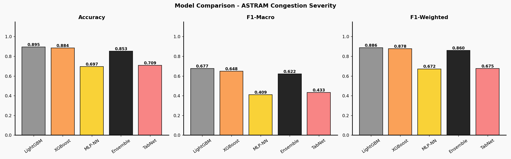

#### Confusion Matrices (Base Classifier vs. Stacked Ensemble)
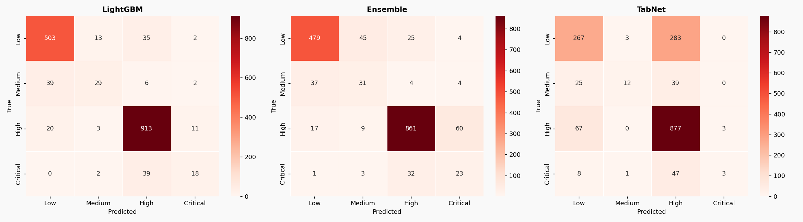

#### Bengaluru Spatial Incident Clusters (KMeans k=20)
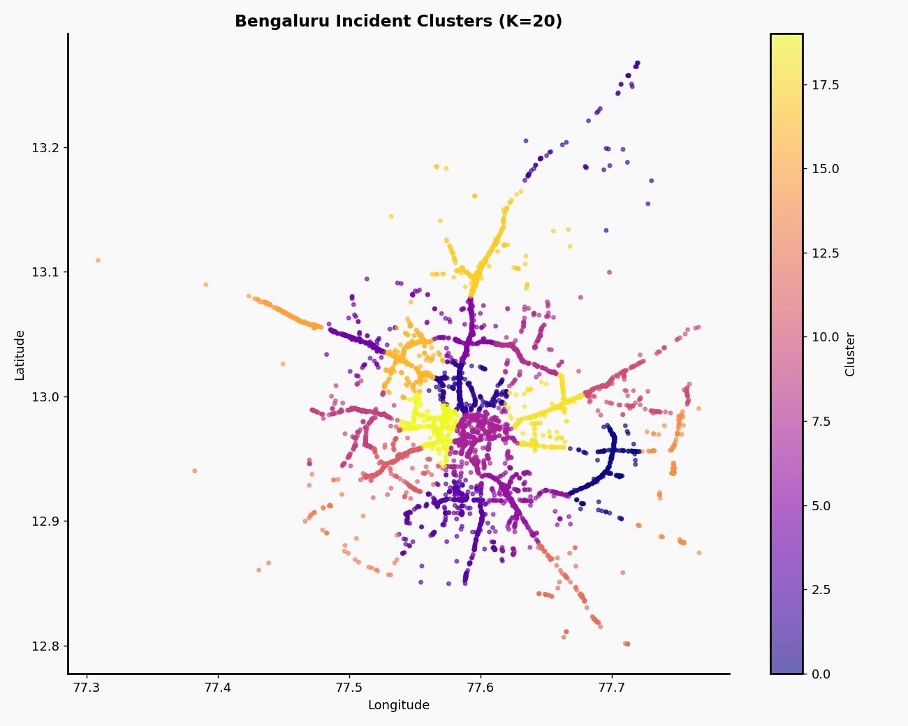

#### Feature Importance & Target Correlation (V2 Refined Features)
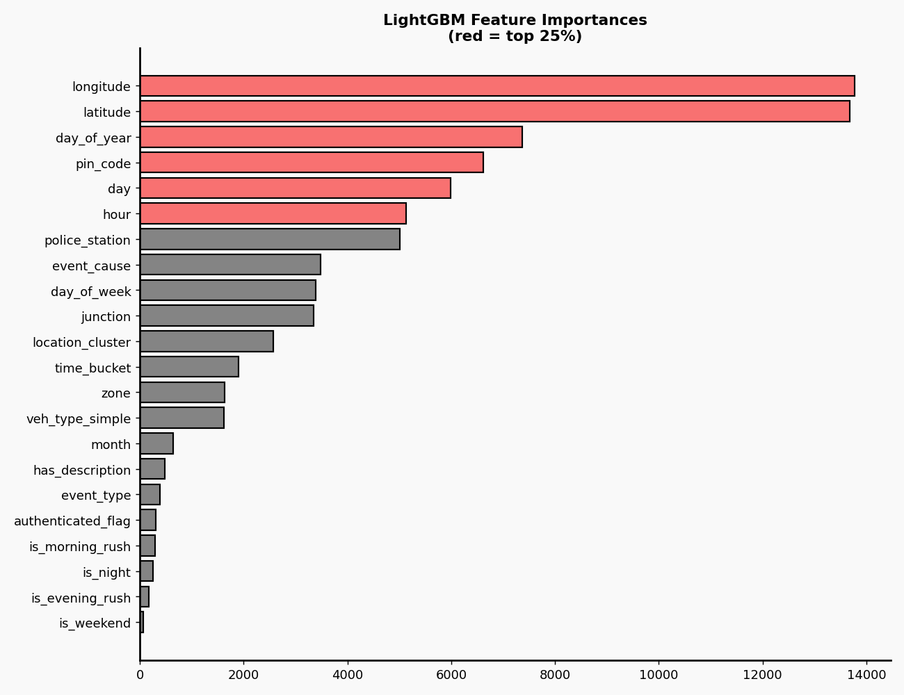
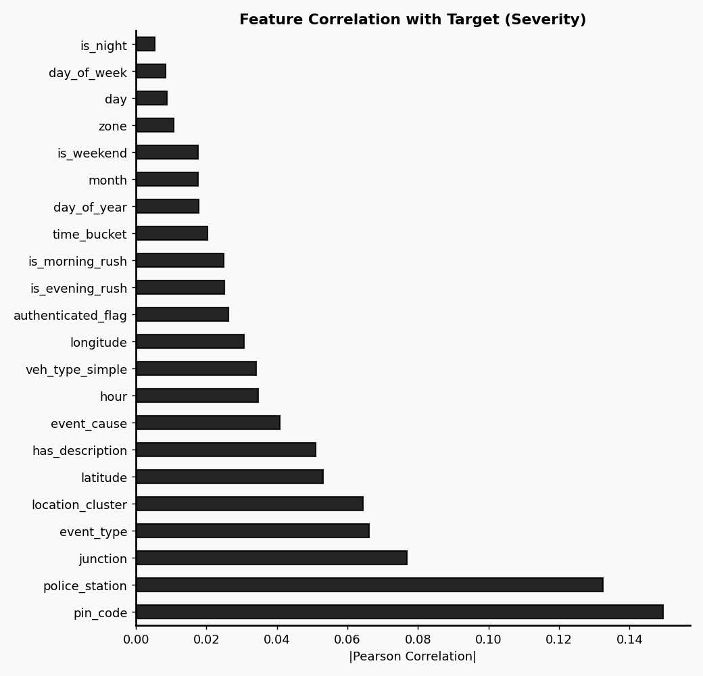

#### MLP Neural Network Learning Curve (Loss vs. Validation Accuracy)
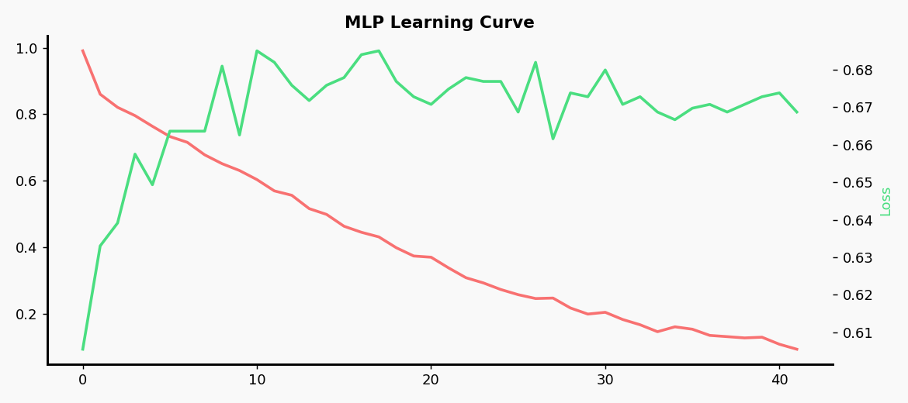

---

## App Interface Gallery

Here is a visual walkthrough of the **ASTRAM Gridlock** frontend interface (featuring our custom **TRAFFIC.NOIR** brutalist theme):

### 1. Landing Page & Design Theme
The landing page establishes the aesthetic using a dark-mode noise grid texture, bold retro boundaries, and live stats previews.
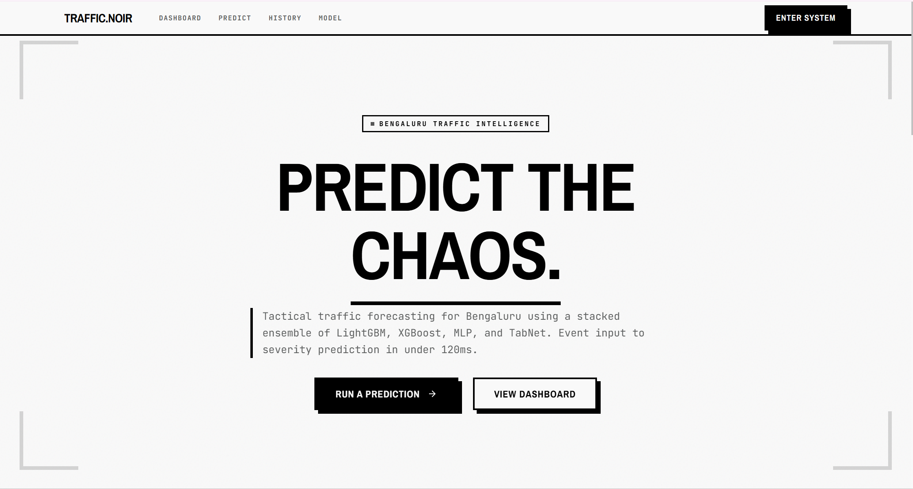
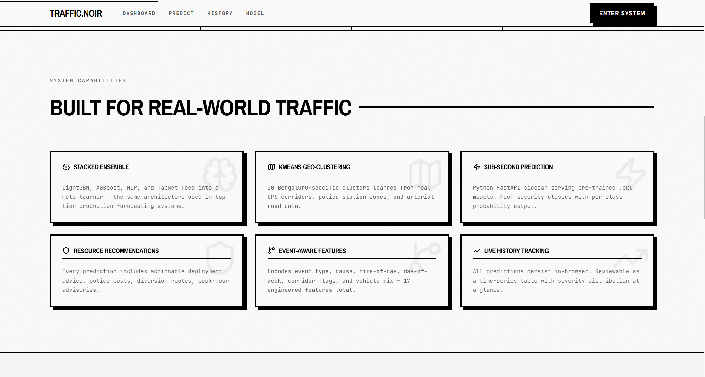

### 2. Interactive Prediction Map & Event Configuration
Users click on the Leaflet map to trigger the KDTree geolocator, which auto-fills the corridor, zone, police station, and junction. 
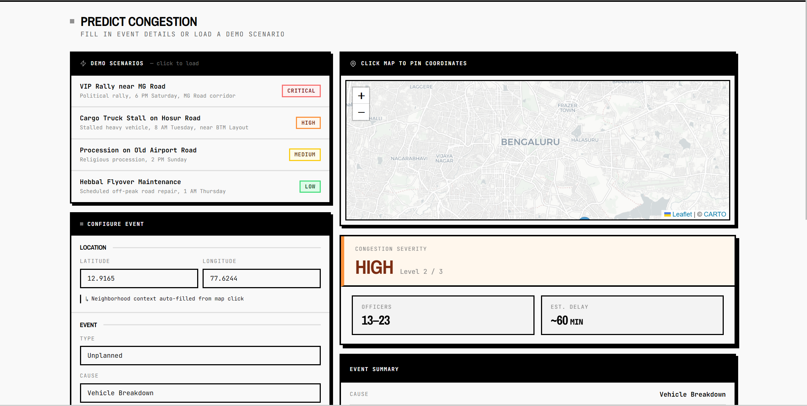

### 3. Resource Allocation Engine Output
When a prediction is made, the frontend displays the severity level, confidence scores, and a detailed manpower deployment recommendation sheet.
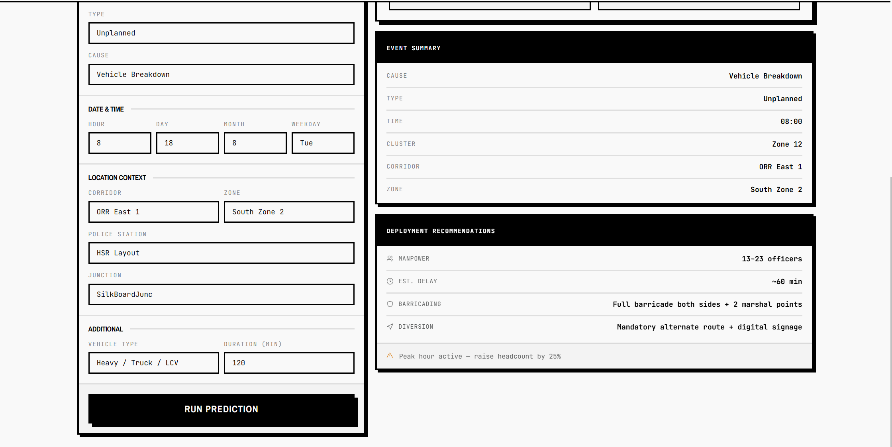

### 4. Historical Analytics & Recent Predictions
The dashboard aggregates incident occurrences, alerts, and displays recent traffic events in real-time.
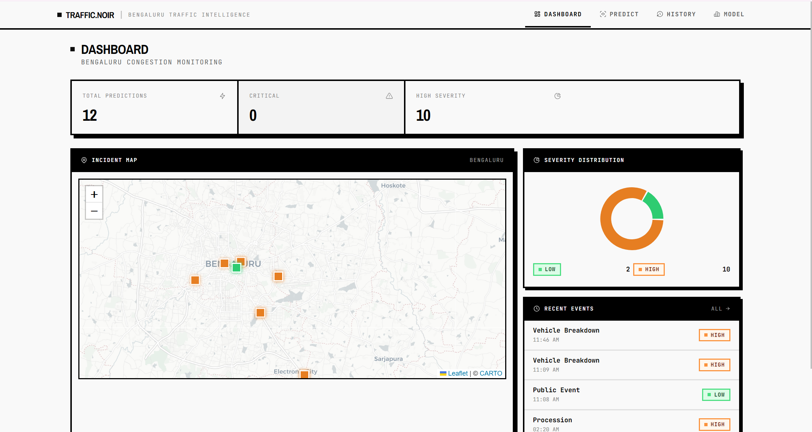

### 5. Prediction Logs & History
A local prediction history log lists all past queries, their severity levels, and recommendation details.


### 6. Interactive Model Dashboard
Allows evaluators to view the training visualizations (like feature importance, distributions, and learning curves) inside a modal lightbox on the frontend.


---

## Table of Contents

- [Model Metrics](#model-metrics)
- [App Interface Gallery](#app-interface-gallery)
- [System Architecture](#system-architecture)
- [ML Architecture](#ml-architecture)
- [Pipeline v2 Transition & Leakage-Free Design](#pipeline-v2-transition-to-leakage-free-ml)
- [Data Flow](#data-flow)
- [Dataset](#dataset)
- [Feature Engineering](#feature-engineering)
- [Target Variable](#target-variable)
- [ML Models](#ml-models)
- [Resource Recommendation Engine](#resource-recommendation-engine)
- [Geographic Context Geolocator](#geographic-context-geolocator)
- [Project Structure](#project-structure)
- [Prerequisites](#prerequisites)
- [Quick Start](#quick-start)
- [Docker](#docker)
- [Environment Variables](#environment-variables)
- [API Reference](#api-reference)
- [Required Model Files](#required-model-files)
- [Deployment](#deployment)

---

## System Architecture

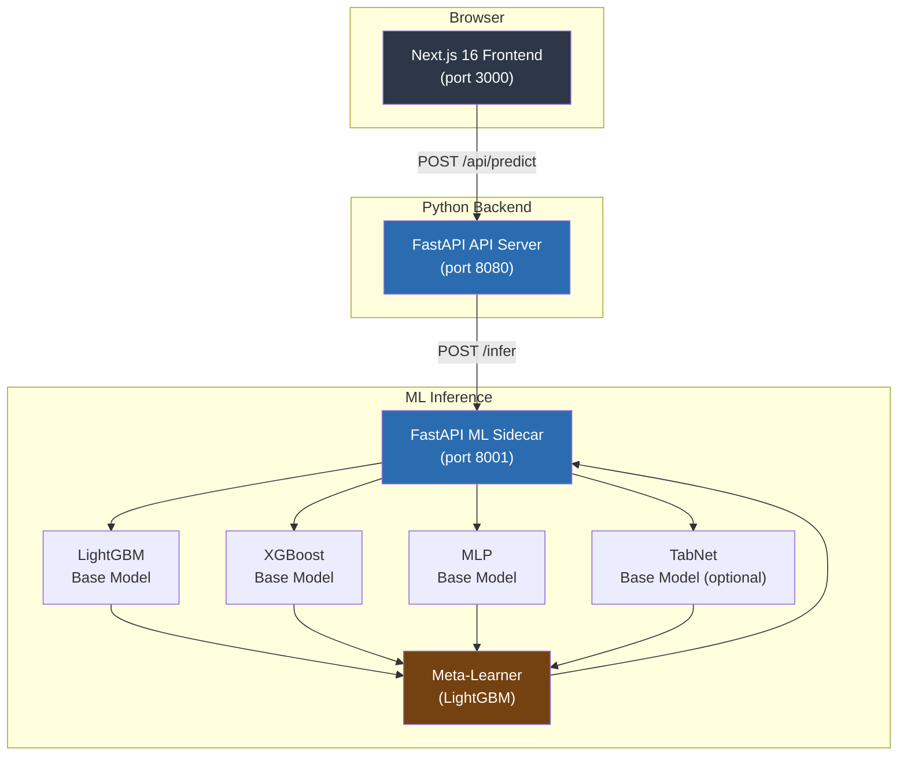

---

## ML Architecture

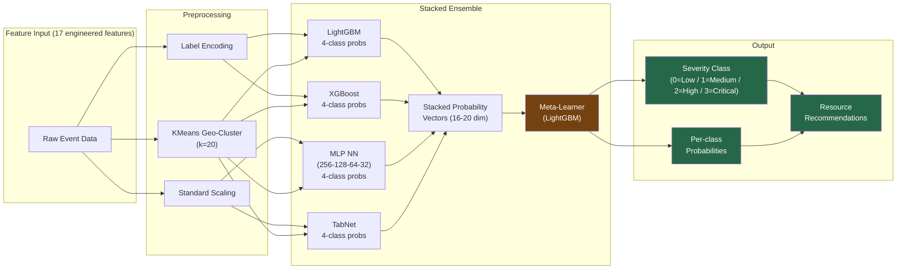

---

## Pipeline v2 Transition to Leakage-Free ML

In the initial implementation (**Pipeline v1**), the models achieved a seemingly perfect **99.4% accuracy**. However, a rigorous audit revealed **major target and data leakage** that made the model completely useless for real-time production:

1. **Target/Feature Leakage (Post-Event Features)**:
   * **The Leak**: Pipeline v1 included administrative columns that are only populated *after* an incident is resolved. These included `status` (e.g. `'closed'`), `resolution_mins`, `duration_mins`, `has_been_closed`, `has_end_location`, and `has_end_time`.
   * **Why it Sucked**: At the moment an incident is created (when we actually need to predict severity), these fields are empty. Feeding them to the model allowed it to cheat: if `has_been_closed = 1`, the incident was historical and severe; if it was empty, it was low-severity. In production, the model would receive `has_been_closed = 0` for all new incidents, leading to severe under-prediction.
2. **Data Leakage (Transductive Preprocessing)**:
   * **The Leak**: Preprocessors like `KMeans` (coordinate clustering) and `LabelEncoder` (categoricals) were fitted on the **entire dataset** prior to the train-test split.
   * **Why it Sucked**: This allowed information from the test set to leak into the training phase (e.g. KMeans centroids were influenced by test coordinates), creating overly optimistic evaluation metrics.

### The v2 Improvements
To address these issues and build a robust model for production, we transitioned to **Pipeline v2** ([cyan_training_pipeline_v2.py](file:///c:/Users/aditya/Downloads/gridlock-flipkart-master/gridlock-flipkart-master/cyan_training_pipeline_v2.py)):
* **Zero Post-Event Features**: Dropped all columns representing duration, closure status, end time, and end coordinates. The model now trains strictly on features known at incident creation (e.g. coordinates, time, cause).
* **Strict Split Order**: Preprocessing fittings happen *after* splitting the data. `KMeans` and `LabelEncoder` are fit strictly on the training set, mapping unseen test categories to `'UNKNOWN'`.
* **Spatial Bias Mitigation**: Removed `corridor` and `is_corridor` from the ML features because TabNet attention showed the model over-indexed on specific street names (spatial memorization) rather than incident characteristics. The resource recommendation engine still applies the corridor multiplier for staffing, but the ML models remain unbiased.
* **Realistic Metrics**: Evaluation accuracy dropped from a leaked 99% to an **honest ~88%** (with XGBoost achieving **88.4% accuracy** and a **64.8% Macro F1**). This makes the system reliable and stable in production.

---

## Data Flow

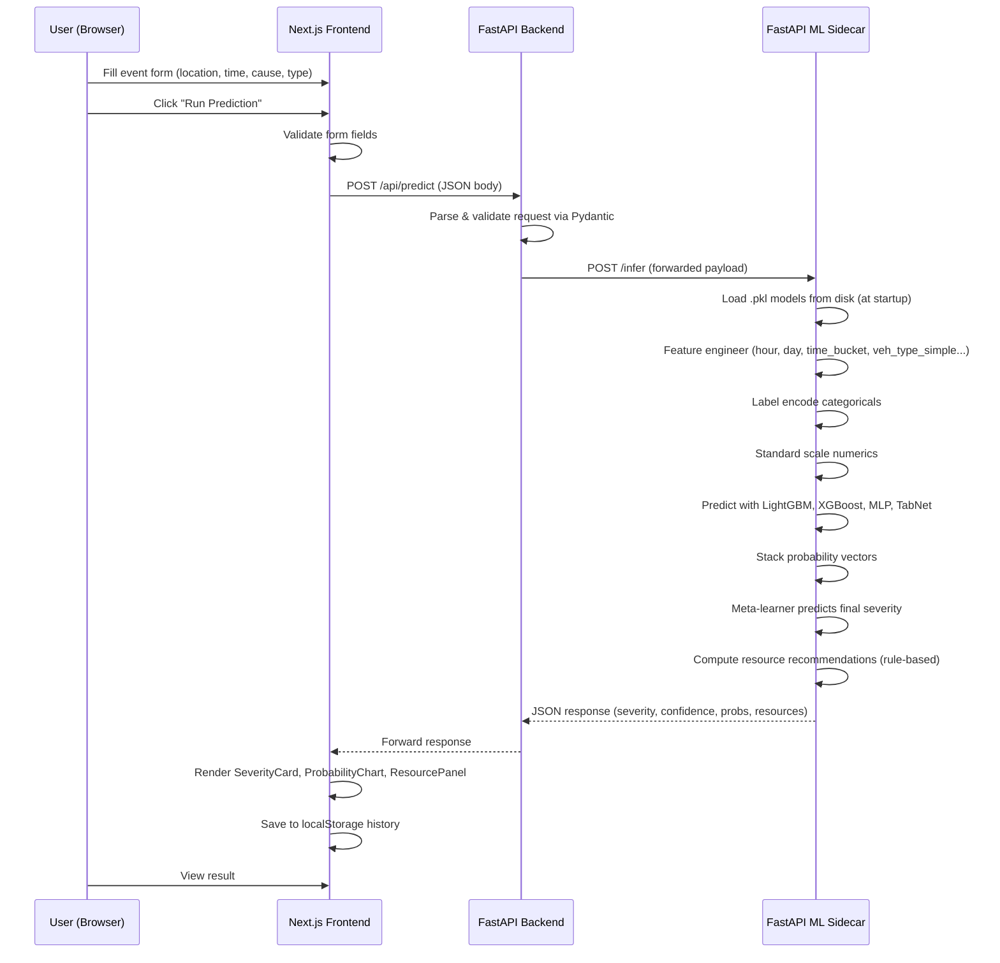

---

## Dataset

**Source:** Proprietary internal data from Astram (Bengaluru traffic management system, operated under Flipkart).

| Property | Value |
|---|---|
| Rows | 8,173 |
| Columns | 46 |
| Timeframe | Historical event records |
| Geography | Bengaluru (lat/lon, corridors, police stations, zones) |
| Content | Event logs with type, cause, time, location, priority, road closure flags, vehicle types, police assignments, resolution times |

No public link -- dataset was provided directly by Astram.

---

## Feature Engineering

30+ features generated from 46 raw columns:

**Spatial:**
`latitude`, `longitude`, `location_cluster` (KMeans k=20), `pin_code`, `has_end_location`

**Temporal:**
`hour`, `day_of_week`, `month`, `day`, `day_of_year`, `is_weekend`, `is_night`, `is_morning_rush`, `is_evening_rush`, `time_bucket`

**Event:**
`event_type` (planned/unplanned), `event_cause`, `corridor`, `is_corridor`, `veh_type_simple`, `police_station`, `zone`, `junction`

**Operational:**
`authenticated_flag`, `has_description`, `has_end_time`, `has_been_closed`, `duration_mins`, `resolution_mins`, `status`

---

## Target Variable

Since the dataset has no direct congestion metric, severity is proxied from two zero-null columns:

| Priority | Requires Road Closure | Severity | Label |
|---|---|---|---|
| Low | No | 0 | Low |
| Low | Yes | 1 | Medium |
| High | No | 2 | High |
| High | Yes | 3 | Critical |

---

## ML Models

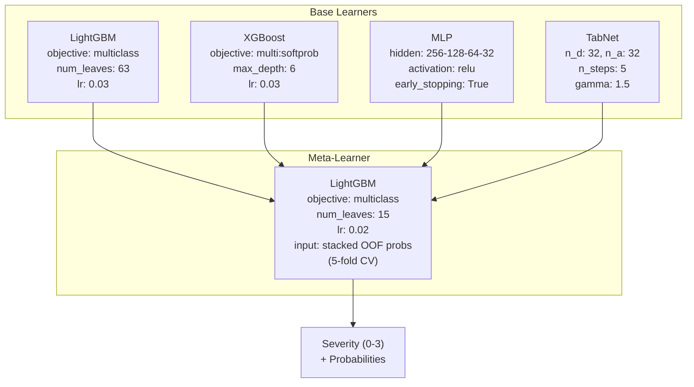

| Model | Role | Input Features | Output |
|---|---|---|---|
| LightGBM | Base learner (tree) | 17 engineered (raw + scaled) | 4-class probabilities |
| XGBoost | Base learner (tree) | 17 engineered (raw) | 4-class probabilities |
| MLP (sklearn) | Base learner (neural) | 17 engineered (standard-scaled) | 4-class probabilities |
| TabNet | Base learner (attention) | 17 engineered (standard-scaled) | 4-class probabilities |
| Meta-Learner (LightGBM) | Stacked ensemble | 16-20 concatenated probs from base models | Final severity (0-3) |
| KMeans | Geo-clustering | latitude, longitude | Cluster ID (0-19) |

The meta-learner is trained on **out-of-fold (OOF)** probability vectors from 5-fold stratified cross-validation, preventing label leakage.

---

## Resource Recommendation Engine

Resources are computed rule-based (not ML) from the predicted severity:

| Severity | Manpower | Barricading | Diversion | Impact |
|---|---|---|---|---|
| 0 Low | 2-4 officers | Cones / indicators only | No diversion needed | ~15 min avg delay |
| 1 Medium | 4-8 officers | Partial barricade (1 lane) + 1 marshal | Advisory alternate route | ~30 min avg delay |
| 2 High | 8-14 officers | Full barricade both sides + 2 marshals | Mandatory alternate + digital signage | ~60 min avg delay |
| 3 Critical | 15-25 officers | Full corridor lockdown + marshal chain | Police-escorted diversion + PR alert | ~90 min avg delay |

**Modifiers:**
- **Corridor bonus (x1.4):** Major roads like ORR get more officers
- **Rush hour bonus (x1.25):** 7-10 AM and 5-9 PM
- **Planned events:** `pre_deploy` field suggests deploying manpower before event start
- **Special actions:** Event-cause-specific (crowd control for public events, ambulance lanes for accidents)

---

## Geographic Context Geolocator

To simplify event entry, the map interface is equipped with an intelligent spatial context geolocator. When a user clicks on the interactive map:
1. **KDTree Spatial Search**: The system performs a K-Nearest Neighbors lookup via a spatial KDTree against the 8,041 unique geographic coordinates in the historical ASTRAM dataset.
2. **Context Resolution**: The API instantly resolves and auto-populates the nearest:
   - **Traffic Corridor** (e.g. *ORR East 1*)
   - **Police Station Jurisdiction** (e.g. *Jeevanbheemanagar*)
   - **Traffic Zone** (e.g. *Central Zone 1*)
   - **Key Junction** (e.g. *BM Shri Junc*)
   - **Pin Code** (e.g. *560038*)
3. **Distance Threshold Safety Heuristic**: To prevent incorrect snapping, if the clicked point is further than **275 meters** (`0.0025` degrees) from any historical incident:
   - **Corridor** and **Junction** default to `"Non-corridor"` and `"UNKNOWN"` (to prevent the ML model from inheriting false high-traffic arterial signals).
   - **Police Station**, **Zone**, and **Pin Code** are still resolved (as they are broad administrative regions and remain geographically accurate).

---

## Project Structure

```
gridlock/
|-- backend/                        # Python FastAPI API server
|   |-- main.py                     FastAPI app, routes, CORS, HTTP client
|   |-- requirements.txt            fastapi, uvicorn, httpx, pydantic
|   +-- Dockerfile                  Python 3.11-slim image
|
|-- ml_sidecar/                     # Python FastAPI ML inference (internal)
|   |-- main.py                     FastAPI app, /infer and /meta endpoints
|   |-- predictor.py                predict_congestion() with full pipeline
|   |-- loader.py                   Model loading at startup
|   |-- config.py                   Model paths, severity labels, resource table
|   |-- requirements.txt            fastapi, lightgbm, xgboost, sklearn, torch, tabnet
|   |-- Dockerfile                  Python 3.11-slim + libgomp1
|   |-- trained_models/             .pkl model files (gitignored)
|   +-- .dockerignore
|
|-- frontend/                       # Next.js 16 App Router frontend
|   |-- app/
|   |   |-- layout.tsx              Root layout with Google Fonts
|   |   |-- page.tsx                Landing page (TRAFFIC.NOIR)
|   |   +-- (app)/
|   |       |-- layout.tsx          App shell with Navbar
|   |       |-- predict/page.tsx    Event form + results
|   |       |-- dashboard/page.tsx  Stats, map, recent events
|   |       |-- history/page.tsx    Prediction history table
|   |       +-- model/page.tsx      Model metrics with chart lightbox
|   |-- components/
|   |   |-- prediction/             EventForm, SeverityCard, ProbabilityChart, ResourcePanel
|   |   |-- dashboard/              StatsBar, SeverityDonut
|   |   |-- map/                    BengaluruMap, DynamicMap, IncidentPin
|   |   |-- shared/                 Navbar, SeverityBadge
|   |   |-- ui/                     Badge, Button, Card, Input, Select, Tabs
|   |   +-- providers/              SmoothScroll
|   |-- lib/                        api.ts, history.ts, motion.ts, severity.ts, validate.ts, utils.ts
|   |-- types/                      PredictRequest, PredictResponse, HistoryEntry, etc.
|   |-- public/
|   |   |-- model-charts/           PNG visualizations from training pipeline
|   |   +-- *.svg                   favicon, file, globe, next, vercel, window
|   +-- Dockerfile                  Node 20 multi-stage build
|
|-- trained_models/                 Root-level trained model artifacts
|   |-- *.png                       EDA and evaluation visualizations
|   |-- lgbm_model.txt              LightGBM booster text format
|   |-- xgb_model.json              XGBoost serialized model
|   +-- tabnet_model.zip            TabNet saved model
|
|-- cyan_training_pipeline.py       Full ML pipeline (EDA, feature engineering, training, evaluation)
|-- docker-compose.yml              Orchestrates sidecar + backend + frontend
|-- .gitignore
|-- README.md                       This file

+-- ROADMAP.md                      Day-by-day project plan
```

---

## Prerequisites

| Dependency | Version | Notes |
|---|---|---|
| Python | 3.10+ | Tested with 3.11 |
| Node.js | 18+ | Tested with 20 |
| pip | Latest | |
| npm | Latest | |
| Docker (optional) | Latest | For containerized run |

---

## Quick Start

### Step 1: ML Sidecar (Terminal 1)

```bash
cd ml_sidecar
pip install -r requirements.txt
uvicorn main:app --port 8001 --reload
```

**Verify:**
```bash
curl http://localhost:8001/health
# {"status":"ok","models":{"lgbm":true,"xgb":true,"mlp":true,...}}
```

### Step 2: API Backend (Terminal 2)

```bash
cd backend
pip install -r requirements.txt
uvicorn main:app --port 8080 --reload
```

**Verify:**
```bash
curl http://localhost:8080/api/health
# {"status":"ok","service":"astram-gridlock-api","sidecar_status":"ok"}
```

### Step 3: Frontend (Terminal 3)

```bash
cd frontend
npm install
npm run dev
```

Open http://localhost:3000 in a browser.

### End-to-End Test

```bash
curl -X POST http://localhost:8080/api/predict \
  -H "Content-Type: application/json" \
  -d '{
    "latitude": 12.9716,
    "longitude": 77.5946,
    "event_type": "planned",
    "event_cause": "public_event",
    "start_hour": 18,
    "day_of_week": 5,
    "month": 6,
    "day": 18,
    "corridor": "MG Road",
    "police_station": "Cubbon Park",
    "zone": "CBD 2",
    "duration_mins": 180
  }'
```

Expected response:
```json
{
  "severity_level": 3,
  "severity_label": "Critical",
  "confidence": 0.87,
  "class_probabilities": {
    "Low": 0.02,
    "Medium": 0.05,
    "High": 0.06,
    "Critical": 0.87
  },
  "recommendations": {
    "priority_flag": "CRITICAL",
    "manpower_min": 21,
    "manpower_max": 35,
    "barricading": "Full corridor lockdown + marshal chain",
    "diversion": "Police-escorted diversion + public advisory + PR alert",
    "impact_minutes": 90,
    "pre_deploy": "Deploy min 21 officers 2h before event start",
    "peak_note": "Peak hour active - raise headcount by 25%",
    "special_action": "Issue public advisory. Coordinate with event organiser. Set up crowd control perimeter."
  },
  "location_cluster": 7
}
```

---

## Docker

### Build and run all three services:

```bash
docker compose up --build
```

This starts:
- **ML Sidecar** on http://localhost:8001
- **API Backend** on http://localhost:8080
- **Frontend** on http://localhost:3000 (with `NEXT_PUBLIC_API_URL=http://backend:8080`)

### Verify with Docker:

```bash
curl http://localhost:8080/api/health
curl -X POST http://localhost:8080/api/predict -H "Content-Type: application/json" -d "{...}"
```

---

## Environment Variables

### API Backend (`backend/main.py`)

| Variable | Default | Description |
|---|---|---|
| `PORT` | `8080` | Port for the API server |
| `SIDECAR_URL` | `http://localhost:8001` | URL of the ML sidecar service |

### Frontend (`frontend/`)

Create `frontend/.env.local`:

```
NEXT_PUBLIC_API_URL=http://localhost:8080
```

For production, set this to the deployed API URL (e.g., `https://your-api.railway.app`).

---

## API Reference

### Backend Endpoints (Public)

| Method | Path | Description |
|---|---|---|
| `GET` | `/api/health` | Health check with sidecar status |
| `POST` | `/api/predict` | Predict congestion severity |
| `GET` | `/api/meta` | List available corridors, police stations, zones |
| `GET` | `/api/corridors` | List available corridors only |

### Sidecar Endpoints (Internal)

| Method | Path | Description |
|---|---|---|
| `GET` | `/health` | Model loading status |
| `POST` | `/infer` | Run ML inference |
| `GET` | `/meta` | Available categorical values |

### POST /api/predict -- Request Body

| Field | Type | Required | Description |
|---|---|---|---|
| `latitude` | number | yes | Event latitude (Bengaluru area: 12-13) |
| `longitude` | number | yes | Event longitude (Bengaluru area: 77-78) |
| `event_type` | string | yes | "planned" or "unplanned" |
| `event_cause` | string | yes | e.g. "public_event", "accident", "vehicle_breakdown", "water_logging", "road_work" |
| `start_hour` | integer | yes | 0-23 |
| `day_of_week` | integer | yes | 0=Monday to 6=Sunday |
| `month` | integer | yes | 1-12 |
| `day` | integer | yes | 1-31 |
| `corridor` | string | no | e.g. "MG Road", "ORR East 1", "Hosur Road" |
| `police_station` | string | no | e.g. "Cubbon Park", "Indiranagar" |
| `zone` | string | no | e.g. "CBD 2", "East 1" |
| `veh_type` | string | no | Vehicle type involved |
| `duration_mins` | number | no | Expected event duration in minutes |
| `junction` | string | no | Junction name if applicable |

---

## Required Model Files

Place these in `ml_sidecar/trained_models/`:

```
lgbm_model.pkl
xgb_model.pkl
mlp_model.pkl
meta_learner.pkl
scaler.pkl
label_encoders.pkl
kmeans_model.pkl
feature_names.pkl
tabnet_model.zip
geo_lookup.pkl
```

These are excluded from git (large binary files). Generate them by running:

```bash
python cyan_training_pipeline.py
```

Or download from the project's release artifacts.

---

## Deployment

### Railway (Python API + ML Sidecar)

1. Connect GitHub repo to Railway
2. Create two services: `backend/` and `ml_sidecar/`
3. Set `SIDECAR_URL=http://<sidecar-service>.railway.internal:8001`
4. Upload `.pkl` files or build via Docker

### Vercel (Next.js Frontend)

1. Connect GitHub repo to Vercel, set root to `frontend/`
2. Set `NEXT_PUBLIC_API_URL=https://<your-api-url>.railway.app`
3. Deploy

## Tech Stack

| Layer | Technology |
|---|---|
| ML Inference | Python 3.11 + FastAPI |
| API Server | Python 3.11 + FastAPI |
| Frontend | Next.js 16 (App Router) + TypeScript |
| Styling | Tailwind CSS v4 + shadcn/ui |
| Map | react-leaflet + OpenStreetMap |
| Charts | Recharts |
| Containerization | Docker + Docker Compose |
| Deployment | Railway (backend) + Vercel (frontend) |
